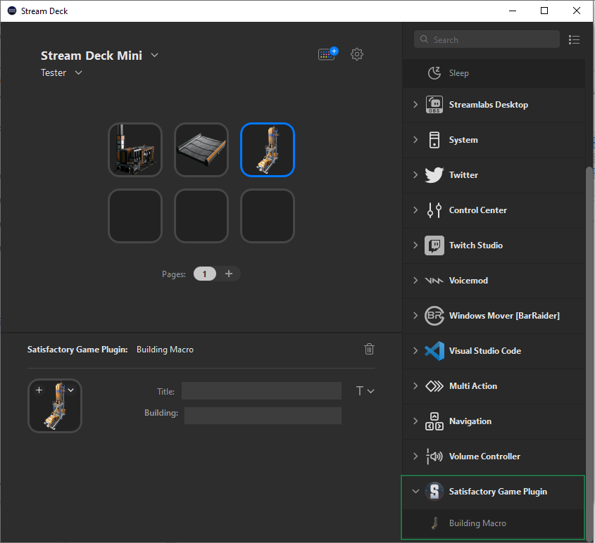
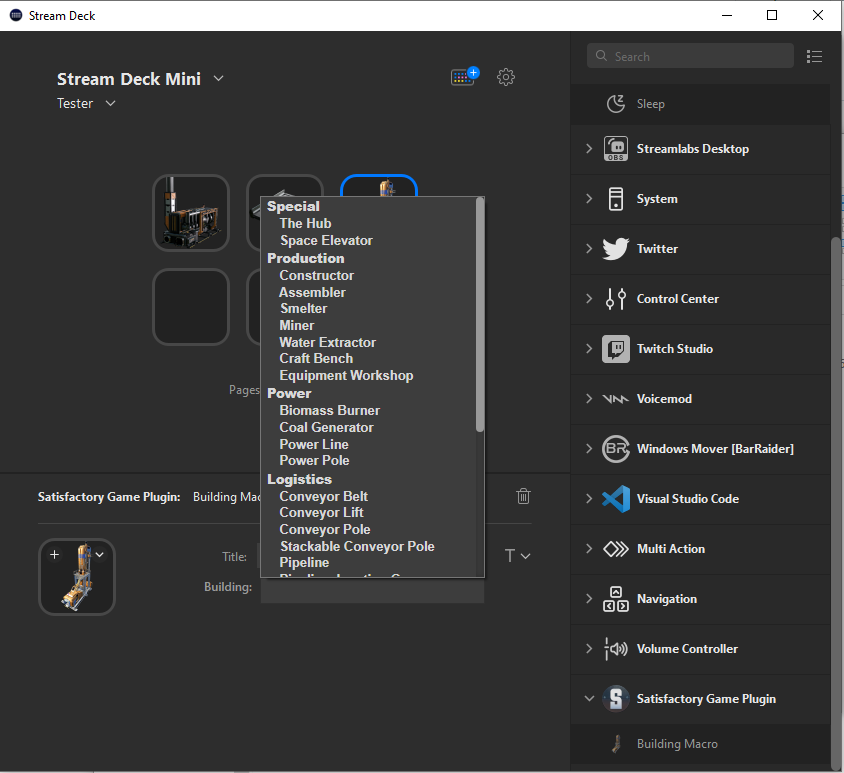
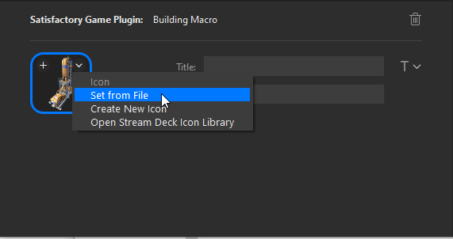

## Welcome

This repo is a plugin for Elgato Stream Deck and specifically for the video game Satisfactory!

## Using the plugin

- Download and install latest release: https://github.com/Brett-Parker/streamdeck-satisfactory/releases

- Once installed, drag and drop the "Building Macro" below on to a location in your Stream Deck profile.

- Click the newly created icon (Will appear as a Miner). At the bottom select the "Building" dropdown and select the desired Building. (Title is optional)

For the icon, at the bottom left, choose "Set from file"

- Navigate to (Replace with your username): C:\Users\<user>\AppData\Roaming\Elgato\StreamDeck\Plugins\envy.satisfactory.bu.sdPlugin\images

- Choose image to suit

That's it! Simply use in Satisfactory

## Credits

Thank you to Jeffrey T. Fritz https://github.com/FritzAndFriends/StreamDeckToolkit
